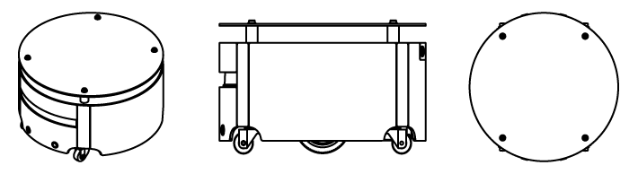

# Caster ROS

<p align="center"></p>

## Overview

IQR Caster robot ROS packages, contains caster_robot and caster_desktop installer.

## License
This project is licensed under the [MIT License](LICENSE).

## Installation
See below for caster ROS package installation

### Caster robot package
The following command will install caster_robot, caster_description and depends

```bash
cd ~/catkin_ws/src

# over SSH
wstool init https://raw.githubusercontent.com/CasterLab/caster_rosinstall/master/caster_robot_ssh.rosinstall
# or over HTTPS
wstool init https://raw.githubusercontent.com/CasterLab/caster_rosinstall/master/caster_robot_https.rosinstall

wstool update
rosdep install --from-paths . --ignore-src -r -y
sudo cp caster_robot/caster_base/config/57-caster-robot.rules /etc/udev/rules.d/
cd ~/catkin_ws
catkin_make
```

### Caster desktop package
The following command will install caster_desktop, caster_description and depends

```bash
cd ~/catkin_ws/src

# over SSH
wstool init https://raw.githubusercontent.com/CasterLab/caster_rosinstall/master/caster_desktop_ssh.rosinstall
# over HTTPS
wstool init https://raw.githubusercontent.com/CasterLab/caster_rosinstall/master/caster_desktop_https.rosinstall

wstool update -t src
rosdep install --from-paths . --ignore-src -r -y
cd ~/catkin_ws
catkin_make
```

## ROS package
Caster ROS package has three parts, See below for details.

 - [caster_app][1]: Application and demo
 - [caster_desktop][2]: visualize, control tools
 - [caster_description][3]: robot description(URDF) for caster
 - [caster_msgs][4]: message, actionlib and service definition
 - [caster_robot][5]: hardware driver etc
 - [caster_simulator][6]: Gazebo simulator

### caster_app

Application and demo

### caster_desktop

Desktop ROS packages for the Caster, which may pull in graphical dependencies.

 - caster_viz : Visualization (rviz) configuration and bringup
 - caster_teleop : Joystick teleop configuration and launch file

### caster_description
ROS package for the Caster, which contains robot description (URDF)

### caster_msgs

ROS package for the Caster message, actionlib and service definition

### caster_robot

ROS packages for the Caster robot, for operating Caster robot hardware. 

 - caster_auto_charge: Auto charge service server
 - caster_base : Hardware interface 
 - caster_control : ROS controller configuration
 - caster_navigation : Navigation configurations and launch files

### caster_simulator

ROS package for the Caster simulator

------
© 2019 Beijing I-Quotient Robot Technology Co., Ltd. All Rights Reserved

[1]: https://github.com/CasterLab/caster_app
[2]: https://github.com/CasterLab/caster_desktop
[3]: https://github.com/CasterLab/caster_description
[4]: https://github.com/CasterLab/caster_msgs
[5]: https://github.com/CasterLab/caster_robot
[6]: https://github.com/CasterLab/caster_simulator

