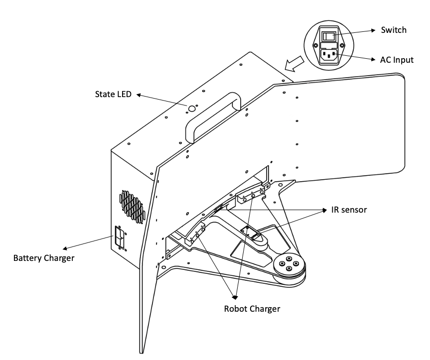
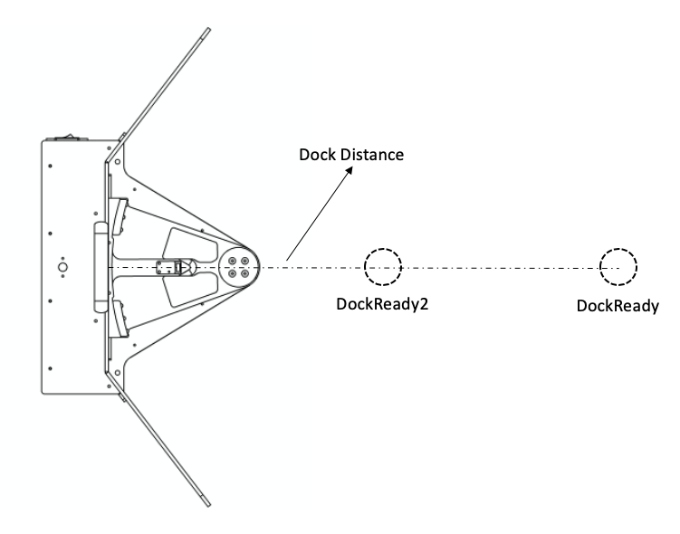

# 自动充电原理及配置

本文描述了自动充电功能的原理，以及如何正确配置自动充电功能

**注：自动充电功能目前处于调试阶段**

## 自动充电桩

<p align="center"></p>


1. 电源指示：常亮（电源开启），常灭（电源关闭）
2. 充电阀指示：常亮（充电阀开启），闪烁（充电阀关闭）

## 自动充电原理

<p align="center"></p>


1. 根据参数配置，先导航至`DockReady`目标点
2. 到达`DockReady`后，根据激光雷达的数据，计算出充电桩的具体位置
3. 结合充电桩位置和`dock_distance`参数，计算出DockReady2的位置
4. 导航至`DockReady2`
5. 向正前方行走`dock_distance-robot_radius`距离，进入充电桩
6. 充电桩检测到有机器进入时，开启充电阀，充电阀灯从闪烁变为常亮
7. 打开Caster的充电继电器，开始受电
8. 收到推出指令
9. 关闭Caster的充电继电器
10. 推出
11. 充电桩检测到机器人的推出，关闭充电阀，充电阀从常亮变为闪烁

## 参数配置

1. 参考[快速启动指南-定位导航](quick_start.md#定位导航)完成地图的建立，并开启导航功能

2. 参考[快速启动指南-手柄控制](quick_start.md#手柄控制)，启动手柄控制功能

3. 将充电桩摆放至合适的位置

   - 周围没有和充电桩相似形状的物体
   - 充电桩附近地面平整无杂物

4. 使用如下指令显示当前机器人坐标

   ```bash
   rostopic echo /amcl_pose
   ```

5. 移动机器人至充电桩正前方2米左右的位置，并根据记录`Step 3`中当前机器人的坐标和朝向，如下示例

   ```bash
   header: 
     seq: 0
     stamp: 
       secs: 1564718682
       nsecs: 404755046
     frame_id: "map"
   pose: 
     pose: 
       position: 
         x: 0.012765523603
         y: -0.00185758867047
         z: 0.0
       orientation: 
         x: 0.0
         y: 0.0
         z: 8.56034512309e-05
         w: 0.999999996336
     covariance: [0.2470653041573616, 0.0019165315976033225, 0.0, 0.0, 0.0, 0.0, 0.0019165315976033246, 0.24600273131249162, 0.0, 0.0, 0.0, 0.0, 0.0, 0.0, 0.0, 0.0, 0.0, 0.0, 0.0, 0.0, 0.0, 0.0, 0.0, 0.0, 0.0, 0.0, 0.0, 0.0, 0.0, 0.0, 0.0, 0.0, 0.0, 0.0, 0.0, 0.06848905809146005]
   
   ```

6. 将记录信息中的`position`和`orientation`信息记录到`caster_app/config/caster_app.yaml`中，如下示例

   ```yaml
   dock:
     pose_x: 0.012765523603
     pose_y: -0.00185758867047
     pose_z: 0.0
     orientation_x: 0.0
     orientation_y: 0.0
     orientation_z: 8.56034512309e-05
     orientation_w: 0.999999996336
     
   ```

7. 根据情况，更改`caster_app.yaml`中的参数，完整示例如下：

   ```yaml
   debug: true                      # 是否打印调试信息
   map_frame: map                   # map frame，地图的frame_id
   odom_frame: odom                 # odom frame，用于最后的进站动作
   base_frame: base_footprint       # base_frame，机器人的frame_id
   
   robot_radius: 0.275              # 机器人的半径
   
   # 充电桩参数
   dock:
     dock_speed: 0.1                # 进入充电桩的速度
     dock_distance: 0.65            # DockReady2距离充电桩前端的距离
     pose_x: 2.03403622872
     pose_y: 0.155554583598
     pose_z: 0.0
     orientation_x: 0.0
     orientation_y: 0.0
     orientation_z: 0.427527075925
     orientation_w: 0.904002543885
   
   ```

## 使用自动充电

1. 参考[快速启动指南-定位导航](quick_start.md#定位导航)，启动Caster的定位导航功能，并正确设置Caster在地图中的位置

2. 参考[快速启动指南-手柄控制](quick_start.md#手柄控制)，启动手柄控制功能

3. 参考[自动充电功能原理和配置-参数配置](auto_charge_description.md#参数配置)，完成对充电桩位置的设定

4. 使用SSH登录Caster-PC，运行如下指令，启动自动充电功能

   ```bash
   roslaunch caster_app caster_app.launch
   ```

5. 按下手柄的`START`按键，Caster开始执行自动充电程序

6. 充电完成后，按下手柄的`BACK`按键，Caster从充电桩中推出

**注意：在Caster位于充电桩内时，勿使用导航功能，以免损坏Caster的受电模块。要使用导航功能，请确保Caster已正确从充电桩中推出**

## Action API

自动充电功能可以通过Actionlib的方式进行调用，关于Actionlib请参考[actionlib documentation](http://wiki.ros.org/actionlib)

### Action Subscribed Topics

`dock_action/goal` (caster_msgs/DockActionGoal)

- 通过写入`DockActionGoal.dock`控制自动充电行为，true 为充电， false为推出

`dock_action/cancel` ([actionlib_msgs/GoalID](http://docs.ros.org/api/actionlib_msgs/html/msg/GoalID.html))

- 用于取消当前正在执行的行为

### Action Published Topics

`dock_action/feedback` (caster_msgs/DockActionFeedback)

- 返回当前行为的执行状态

`dock_action/status` ([actionlib_msgs/GoalStatusArray](http://docs.ros.org/api/actionlib_msgs/html/msg/GoalStatusArray.html))

- 返回当前Action任务的状态

`dock_action/result` (caster_msgs/DockActionResult)

- 在行为结束时，通过此topic返回行为执行结果


